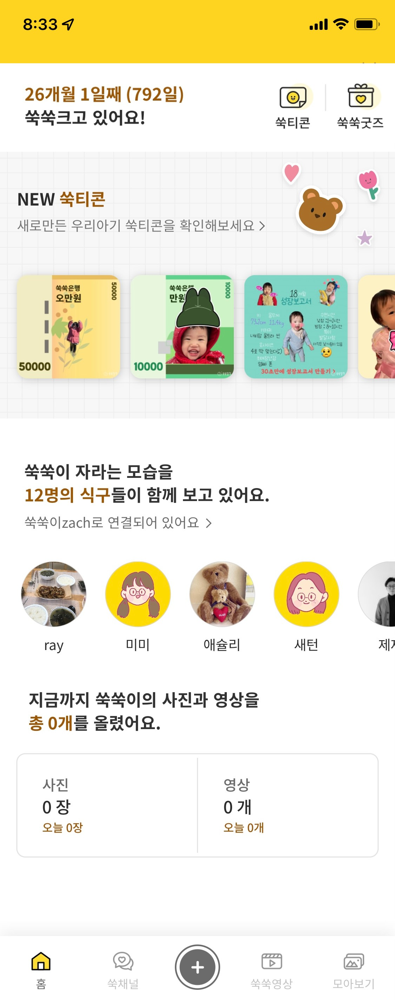

# 쑥쑥찰칵 Android Recruit

쑥쑥찰칵 안드로이드 코딩 테스트 참여에 감사드립니다.
본 테스트는 지원자의 개발 및 협업 역량을 예측하기 위해 진행되며
작성한 코드는 인터뷰에 활용됩니다.

1. 해당 [repository](https://github.com/JEJEMEME/android-recruit)를 자신의 github에 fork 합니다.
2. git clone 을 진행합니다.
3. solution을 작성하여 push를 진행해주세요.

## 요구사항
- 아래와 같이 홈 탭을 구현해주세요.
- [api](https://github.com/JEJEMEME/android-recruit/api)폴더에 있는 데이터를 이용하여 화면을 구성해주세요.
    - baby.json: a,d 영역
    - ticons.json: b 영역
    - family.json: c 영역
- 필요하신 이미지는 [resources](https://github.com/JEJEMEME/android-recruit/resources)폴더에 있는 이미지들을 활용해주세요.
- 하단 영역 및 세세한 디자인은 편하게 작업해주시면 됩니다.
- Kotlin을 사용하여 코드를 작성해주세요.
- 질문이 있으실 경우 help@jejememe.com 으로 메일을 보내주세요.

### 영역별 추가 설명

- A영역
    - birthday와 오늘 사이의 기간을 표시해주세요
        - ex: birthday(2020-01-01), 오늘 (2022-01-03) 일 경우 '24개월 2일째  (733일)'
- B영역
    - profile_image가 null 일 경우 resource에서 type에 따른 기본 이미지 사용
        - type
            - M(엄마): foster_mom.png
            - P(아빠): foster_dad.png
            - MGM(할머니): foster_grandmother.png
            - MGM(할머니): foster_grandmother.png
            - PGM(할머니): foster_grandmother.png
            - PGP(할아버지): foster_grandfather.png
            - E(랜선식구): foster_sitter.png
- D영역
    - photo_count: 업로드 된 전체 사진 개수
    - video_count: 업로드 된 전체 비디오 개수
    - today_photo_count: 오늘 업로드 된 사진 개수
    - today_video_count: 오늘 업로드 된 비디오 개수